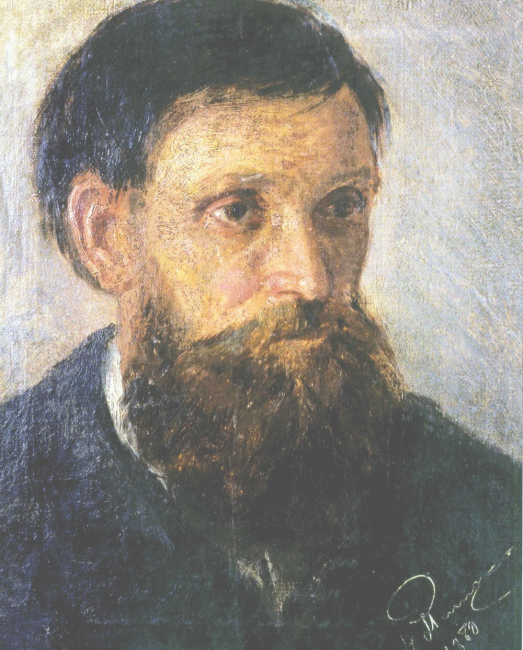

# The purpose of the project
 Site about **"MYKOLA PYMONENKO (1862 - 1912)"**, created for the acquisition of teamwork skills, web design and site development from the Figma platform

# Who is **MYKOLA PYMONENKO**

Ukrainian painter, academician of painting at the St. Petersburg Academy of Arts, member of the Paris International Union of Arts and Letters, author of many paintings on rural and urban themes.

# Used of technology

- HyperText Markup Language ( html )
- Cascading Style Sheets ( css )
- JavaScript ( js )
- Figma ( [figma.com](https://figma.com/) )

# Development team

- UX/UI Design : [**Mintleaf**]()
- Front-End Development : [**Fulldroper**](https://fulldroper.cf/)

# The result of the work carried out

> Site: https://fulldroper.github.io/MYKOLA-PYMONENKO/

> Code Repository: https://github.com/Fulldroper/MYKOLA-PYMONENKO.git

> Design: https://figma.com/ (add after)